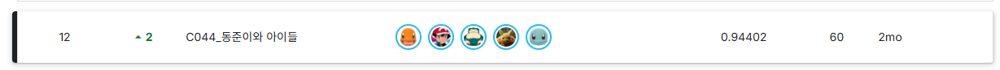
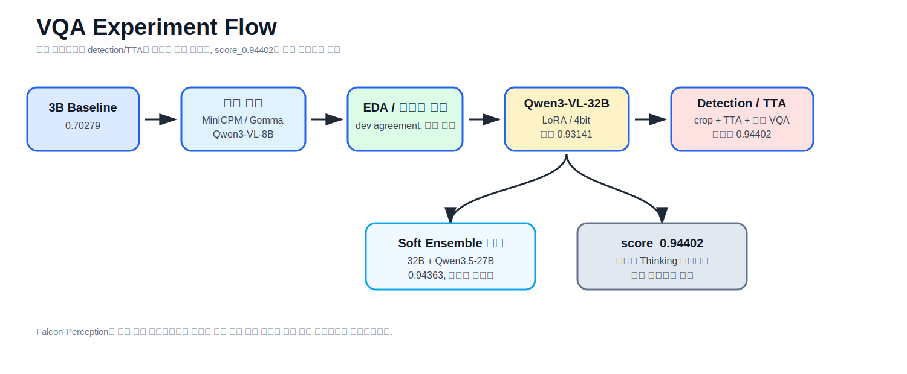
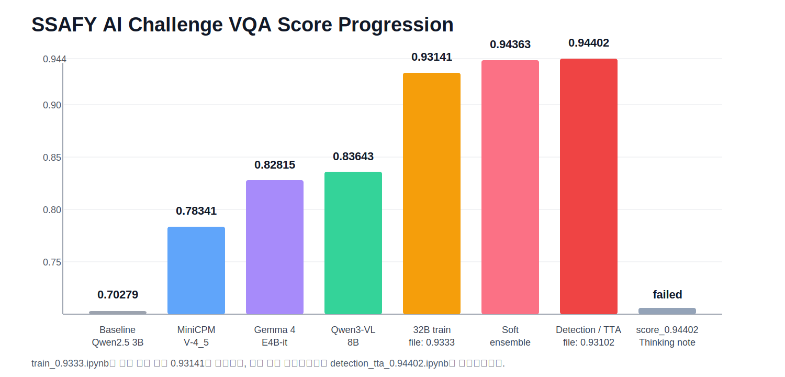
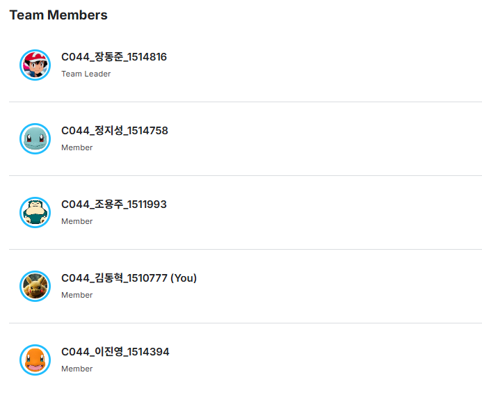

# SSAFY AI Challenge 2026 VQA


재활용품 이미지와 객관식 질문을 입력으로 받아 정답 선택지를 예측하는 VQA 대회 프로젝트입니다. Baseline 코드에서 시작해 모델 교체, 학습 파라미터 조정, Qwen3-VL-32B LoRA 학습, soft ensemble, detection/TTA를 실험했습니다. 최종 제출 파이프라인은 `notebooks/detection_tta_0.94402.ipynb`로 정리했고, selective Thinking 실험은 실패 기록 문서만 남겼습니다.

## 주요 성과

- 최고 제출 점수: 0.94402
- 리더보드: Private Leaderboard 12위, 팀명 `C044_동준이와 아이들`
- 모델 변경 실험: `openbmb/MiniCPM-V-4_5` 0.78341, `google/gemma-4-E4B-it` 0.82815, `Qwen/Qwen3-VL-8B-Instruct` 0.83643
- 32B 학습 실험: `train_0.9333.ipynb` 파일명의 숫자와 별개로 실제 제출 점수는 0.93141로 정리
- 후반 고득점 실험: Qwen3.5-27B soft ensemble 0.94363, detection/TTA 최종 제출 0.94402
- 실패 실험 기록: selective Thinking 아이디어 실험은 노트북 대신 문서만 남김



## 문제 정의

- 입력: 재활용품 이미지 + 질문 + 보기 a/b/c/d
- 출력: 정답 선택지 한 글자
- 평가: 제출 CSV의 `id, answer` 기준 정확도
- 데이터 샘플: `data/`에 train/dev/test split별 10행 CSV와 이미지 샘플 10장씩 포함

이 과제의 어려운 점은 이미지와 질문을 같이 봐야 한다는 점입니다. 모델은 재질, 개수, 형태, 라벨, 포장 상태를 질문 문맥에 맞춰 골라야 했습니다. 또한 dev 응답 불일치와 count/material 질문은 단순 fine-tuning 점수만으로 설명하기 어려워, 데이터 신뢰도와 샘플별 불확실성을 같이 보는 방식이 필요했습니다.

## 접근 방법 요약



1. `Qwen/Qwen2.5-VL-3B-Instruct` 기반 4bit LoRA baseline으로 데이터 로드, 프롬프트 구성, 학습, 제출 CSV 생성을 한 번에 실행했습니다.
2. Hugging Face 모델 카드와 baseline 코드를 기준으로 모델 ID, processor, model class, chat template, 입력 포맷을 바꾸며 `openbmb/MiniCPM-V-4_5`, `google/gemma-4-E4B-it`, `Qwen/Qwen3-VL-8B-Instruct`를 비교했습니다.
3. 병행해서 EDA로 dev 응답 불일치, 질문 유형, count/material 문제를 정리했고, 후속 실험 우선순위를 잡았습니다.
4. 수업 메모와 직접 비교 실험을 바탕으로 learning rate, scheduler, optimizer, label smoothing, LoRA rank/alpha, batch size를 조정했습니다.
5. `Qwen/Qwen3-VL-32B-Instruct` 학습으로 확장했고, `train_0.9333.ipynb`는 실제 제출 기준 0.93141로 정리했습니다.
6. Qwen3-VL-32B와 Qwen3.5-27B를 섞는 soft ensemble을 시험해 0.94363까지 올렸습니다.
7. 후반에는 Grounding DINO, Florence-2, crop, TTA, 듀얼 VQA 결합을 붙인 detection/TTA 파이프라인을 정리했고, 이를 최종 제출 흐름으로 사용했습니다.
8. selective Thinking 후처리 아이디어 실험은 실패 기록으로만 남기고, 노트북 대신 문서로 정리했습니다.

자세한 기록은 아래 문서를 참고하면 됩니다.
- [모델 변경 실험 기록](docs/model-change-experiment.md)
- [detection/TTA 최종 제출 기록](docs/detection-tta-0.94402.md)
- [selective Thinking 실패 실험 기록](docs/selective-thinking-failed-experiment.md)

## 프로젝트 구조

```text
ssafy-ai-challenge-2026-vqa/
├── README.md
├── Image/
│   ├── banner.png
│   ├── members.png
│   ├── private_12th.png
│   ├── pipeline.svg
│   └── score.svg
├── data/
│   ├── README.md
│   ├── train.csv / dev.csv / test.csv
│   ├── example_submission.csv
│   ├── train/
│   ├── dev/
│   └── test/
├── docs/
│   ├── README.md
│   ├── Overview.md
│   ├── Dataset Description.md
│   ├── detection-retrospective.md
│   ├── detection-tta-0.94402.md
│   ├── model-change-experiment.md
│   └── selective-thinking-failed-experiment.md
└── notebooks/
    ├── README.md
    ├── Baseline_0.70279.ipynb
    ├── detection_tta_0.94402.ipynb
    ├── train_0.9333.ipynb
    ├── ensemble_0.94363.ipynb
    └── experimental/
        ├── README.md
        └── EDA.ipynb
```

## 실험 순서

### 1. Baseline 확보

`Baseline_0.70279.ipynb`는 `Qwen/Qwen2.5-VL-3B-Instruct` 기반 4bit LoRA baseline입니다. 이미지 크기는 384로 고정했고, train 데이터 200개를 샘플링해 1차 end-to-end 실행을 검증했습니다.

### 2. 모델 변경 실험

Baseline 코드의 구조를 유지한 채 Hugging Face 모델 카드에 맞춰 모델 ID, processor, model class, trust_remote_code, dtype, chat template을 바꾸며 후보 모델을 실행했습니다.

| 모델 | 실제 점수 | 판단 |
|---|---:|---|
| `openbmb/MiniCPM-V-4_5` | 0.78341 | baseline보다 높았지만 Qwen3-VL-8B보다 낮음 |
| `google/gemma-4-E4B-it` | 0.82815 | 최신 모델이었지만 Qwen3-VL-8B보다 낮음 |
| `Qwen/Qwen3-VL-8B-Instruct` | 0.83643 | 가장 높아 32B 확장의 기준으로 채택 |

### 3. EDA와 데이터 진단

`experimental/EDA.ipynb`에서는 train/dev/test 구조, dev 응답 불일치, 질문 유형, 정답 분포, count/material 문제를 먼저 정리했습니다. 이 단계는 모델 변경과 병행해서 진행했고, 이후 32B 학습·soft ensemble·detection/TTA 우선순위를 잡는 근거로 썼습니다.

### 4. 학습 파라미터 조정

학습 파라미터는 수업 메모와 직접 비교 실험을 바탕으로 정리했습니다. 초기 loss, 작은 샘플 과적합 여부, learning rate 후보, scheduler, label smoothing, optimizer, answer 분포를 같이 보고 설정을 바꿨습니다.

### 5. Qwen3-VL-32B LoRA 학습

`train_0.9333.ipynb`는 `Qwen/Qwen3-VL-32B-Instruct`를 Unsloth와 LoRA로 학습한 노트북입니다. 파일명은 0.9333이지만, 실제 제출 점수는 0.93141로 정리합니다. 이 단계부터 answer와 함께 a/b/c/d 확률을 저장하는 구조가 붙었습니다.

### 6. Soft ensemble

`ensemble_0.94363.ipynb`는 Qwen3-VL-32B 추론 결과를 먼저 만들고, Qwen3.5-27B를 결합해 a/b/c/d 확률을 가중 합산하는 실험입니다. 최고점은 아니지만 후반 고득점 비교 실험으로 남았습니다.

### 7. Detection / TTA 최종 제출

`detection_tta_0.94402.ipynb`는 Grounding DINO와 Florence-2로 관심 객체 crop을 만들고, 원본 이미지와 crop 이미지를 같이 넣어 VQA 추론한 뒤 TTA와 듀얼 모델 확률을 결합한 최종 제출 파이프라인입니다. 자세한 기록은 `docs/detection-tta-0.94402.md`와 `docs/detection-retrospective.md`에 따로 적었습니다.

### 8. selective Thinking 실패 실험

여러 제출의 답이 갈리는 샘플만 Thinking 모델로 다시 보는 후처리 아이디어를 시험했습니다. 다만 로그 파싱과 결과 정리가 불안정해, 노트북 대신 실패 실험 기록만 남깁니다.

## 결과 요약



| 구분 | 결과 요약 | 설명 |
|---|---:|---|
| 최고 제출 | 0.94402 | `detection_tta_0.94402.ipynb` 최종 제출 파이프라인 |
| 리더보드 | Private 12위 / 0.94402 | `Image/private_12th.png`에 보관된 결과 캡처 |
| Baseline | 0.70279 | Qwen2.5-VL-3B-Instruct 4bit LoRA baseline |
| 모델 변경 | 0.78341 → 0.82815 → 0.83643 | MiniCPM-V-4_5, Gemma 4 E4B, Qwen3-VL-8B 비교 |
| 32B 학습 | 0.93141 | `train_0.9333.ipynb`의 실제 제출 점수 |
| Soft ensemble | 0.94363 | Qwen3.5-27B를 결합한 후반 고득점 비교 실험 |
| Detection / TTA | 0.94402 | crop + TTA + 듀얼 VQA 결합, 자세한 내용은 `docs/detection-tta-0.94402.md` 참고 |
| selective Thinking | 실패 실험 | 아이디어 기록만 남기고 공개 레포에서는 노트북 제거 |

## 팀원 소개



- 장동준: 팀장. 팀 채널 운영과 제출 흐름을 맡았고, 27B/35B 계열 시도를 진행했습니다.
- 정지성: 후반 추론 파이프라인과 앙상블·TTA·detection 계열 실험을 주로 진행했습니다.
- 조용주: 이전 대회 코드 조사, baseline 개선 아이디어, 실험 비교 자료 공유를 맡았습니다.
- 이진영: 파라미터 수정 실험과 토큰 처리 이슈 점검을 맡았고, all-a 붕괴 사례를 팀에 공유했습니다.
- 김동혁: 아래 `기여한 내용` 섹션에 따로 정리했습니다.

## 기여한 내용

이 저장소에서 맡은 실험과 정리 작업은 아래처럼 묶을 수 있습니다.

| 영역 | 기여 내용 | 관련 파일 |
|---|---|---|
| EDA 및 데이터 분석 | dev 응답 불일치, 질문 유형, count/material 문제를 분석하고 후속 실험 우선순위를 정리 | `notebooks/experimental/EDA.ipynb` |
| 모델 변경 실험 | baseline 코드에서 모델 카드에 맞춰 MiniCPM-V-4_5, Gemma 4 E4B, Qwen3-VL-8B를 실행하고 비교 | `docs/model-change-experiment.md` |
| 학습 파라미터 조정 | 수업 메모와 직접 비교 실험을 바탕으로 learning rate, scheduler, label smoothing, optimizer, LoRA 설정을 조정 | `docs/model-change-experiment.md`, `notebooks/train_0.9333.ipynb` |
| detection/TTA 정리 | detection crop, TTA, 듀얼 VQA 결합 실험과 객체 인식 회고를 함께 정리 | `docs/detection-tta-0.94402.md`, `docs/detection-retrospective.md`, `notebooks/detection_tta_0.94402.ipynb` |
| 문서 구조 정리 | 노트북 역할과 세부 설명이 맞도록 README와 하위 문서 구조를 정리 | `README.md`, `docs/`, `notebooks/README.md` |
| 실패 실험 정리 | selective Thinking 실패 실험을 노트북 대신 문서로 남김 | `docs/selective-thinking-failed-experiment.md`, `notebooks/experimental/README.md` |

## 트러블슈팅과 배운 점

### 최신 모델과 실제 점수는 다를 수 있음

최신 모델이 항상 점수로 바로 이어지지는 않았습니다. `google/gemma-4-E4B-it`는 최신 모델이었지만 `Qwen/Qwen3-VL-8B-Instruct`보다 낮았습니다. 대회 기간 안에서는 레퍼런스와 출력 안정성이 더 좋은 Qwen3-VL 쪽이 유리했습니다.

### 파일명 점수와 실제 제출 점수는 다를 수 있음

`train_0.9333.ipynb`처럼 파일명에 붙은 숫자와 실제 제출 점수가 다른 경우가 있었습니다. 그래서 이 저장소에서는 파일명보다 실제 재검토 결과를 우선했습니다.

### 실패 실험도 분리해서 남겨야 함

제거한 selective Thinking 실험은 파일명만 보면 대표본처럼 보일 수 있었지만, 로그 파싱과 결과 정리가 불안정했습니다. 그래서 최종 제출 흐름과 실패 실험 기록을 분리해 정리했습니다.

### detection/TTA는 후반 보정이 아니라 최종 제출 흐름으로 다시 봐야 함

detection/TTA는 후반 보조 실험이 아니라, 실제 최종 제출 흐름으로 정리하는 편이 전체 실험 순서와 맞았습니다.

## 문서 안내

- [노트북 설명](notebooks/README.md)
- [대회 개요](docs/Overview.md)
- [Dataset Description](docs/Dataset%20Description.md)
- [모델 변경 실험 기록](docs/model-change-experiment.md)
- [객체 인식 회고](docs/detection-retrospective.md)
- [detection/TTA 최종 제출 기록](docs/detection-tta-0.94402.md)
- [selective Thinking 실패 실험 기록](docs/selective-thinking-failed-experiment.md)
- [데이터 샘플 구조](data/README.md)

## 재현 안내

학습된 모델 weight와 checkpoint는 포함하지 않습니다. 공개 노트북은 실험 순서와 주요 코드를 보여주기 위한 파일입니다. `data/`에는 CSV 구조와 이미지 경로를 설명하기 위한 split별 10행 샘플과 이미지 샘플만 두었습니다. 공개 레포만으로 exact score 재현을 보장하지는 않지만, 모델명, 학습 코드, 추론 로직, 문서화된 점수 재검토 내용을 확인할 수 있게 구성했습니다.

## License

이 저장소는 SSAFY AI Challenge 수행 내용을 포트폴리오/회고 목적으로 정리한 공개용 저장소입니다. 코드와 문서의 재사용 범위는 별도 `LICENSE` 파일을 추가해 정리하는 것을 권장합니다.
