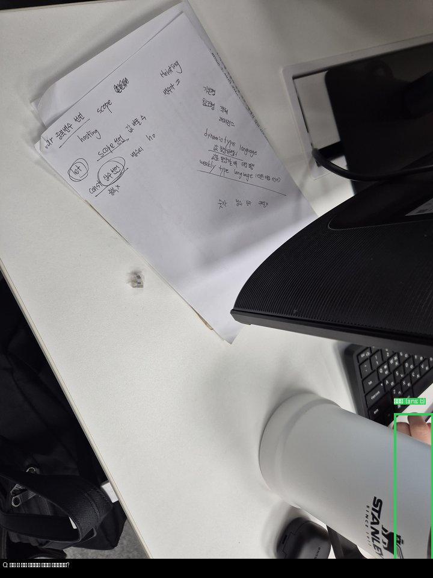

# 객체 인식 회고

## 왜 detection을 따로 보게 되었는가

후반 실험으로 넘어가면서 `Qwen/Qwen3-VL-32B-Instruct`가 이미지 전체를 한 번에 읽을 때는 잘 맞추는 문제와 끝까지 흔들리는 문제가 분명하게 나뉜다는 점을 확인했습니다. 특히 개수, 재질, 복잡한 배경 속 객체 구분처럼 시선이 정확히 가야 하는 문제에서는, VQA 모델이 장면 전체를 이해하더라도 필요한 물체를 안정적으로 짚지 못하는 경우가 있었습니다.

제가 먼저 고민한 지점도 여기였습니다. "질문과 관련된 물체를 먼저 따로 찾게 하면 답이 더 안정되지 않을까?"라는 생각이 들었고, 그래서 객체 인식을 별도 단계로 붙여보자는 방향을 제안했습니다.

## 문제를 확인했던 장면

### 1. Qwen3-VL만으로는 시선이 어긋나는 경우

이 장면에서는 텀블러가 핵심 물체인데, 실제 확인 과정에서는 모델이 답은 맞추더라도 시선이 손이나 주변 영역으로 흔들리는 경우가 있었습니다. 이런 사례를 보면서 "질문의 대상 물체를 먼저 좁혀 주는 단계"가 필요하다고 판단했습니다.

### 2. 사람도 바로 세기 어려운 컵/스틱 배열

컵과 스틱이 겹쳐 있고 반복 패턴이 강해서, 개수를 세거나 재질을 안정적으로 판단하기 어려운 샘플이 있었습니다. 이런 문제는 객체를 찾는 단계만 붙여도 완전히 해결되지는 않는다는 점을 같이 보여줬습니다.

### 3. 경계가 복잡한 박스/종이류 이미지

종이 박스와 포장재가 한 화면에 섞여 있는 경우에는 객체 경계 자체가 흐리고, 어떤 물체를 대표 대상으로 봐야 할지 모호했습니다. 재질이나 종류를 묻는 질문에서 이런 장면은 detector를 붙여도 여전히 어려운 편이었습니다.

## 내가 한 일

- Qwen3-VL-32B가 특히 흔들리는 문제 유형을 먼저 정리했습니다.
- 질문 대상 물체를 따로 찾는 방식이 필요하다고 보고, 객체 인식을 별도 단계로 두는 방향을 제안했습니다.
- 단순히 "모델을 더 크게 쓰자"가 아니라, 시선 정렬 자체를 바꾸는 쪽으로 실험 방향을 넓히는 역할을 맡았습니다.
- 실제 late-stage 파이프라인 적용은 다른 팀원이 진행했고, 나는 왜 이런 방향이 필요했는지에 대한 문제 정의와 제안을 맡았습니다.

## 실제 적용에서는 왜 추론 보조에 머물렀는가

대회 종료까지 시간이 많지 않았기 때문에, 객체 인식을 학습 데이터 구성이나 모델 구조까지 다시 바꾸는 형태로 붙이기에는 시간이 부족했습니다. 그래서 Grounding DINO, Florence-2 같은 공개 detector를 추론 단계에만 붙여 crop을 만들고, 원본 이미지와 함께 넣는 방식으로 빠르게 적용했습니다.

이 선택은 현실적인 타협이었습니다. 짧은 시간 안에 최종 제출 성능을 끌어올리는 데는 도움이 됐지만, 객체 인식 결과를 학습 초반부터 반영한 구조는 아니었기 때문에 한계도 분명했습니다.

## 남은 한계

- 사람도 난해하게 느끼는 개수 문제는 detector를 붙여도 완전히 정리되지 않았습니다.
- 재질 문제는 물체를 찾는 것과 별개로, 표면 질감과 문맥 해석이 같이 필요했습니다.
- 배경이 복잡하거나 객체가 겹친 장면에서는 crop 자체가 충분히 깔끔하지 않았습니다.

즉, detection은 좋은 보조 수단이었지만 후반 추론 단계에만 붙인 방식으로는 모든 어려운 샘플을 해결할 수 없었습니다.

## 다음에 비슷한 대회를 한다면

다음에는 객체 인식을 대회 막판 보조 실험으로만 붙이지 않고, 더 앞단에서부터 설계할 생각입니다.

- 질문 대상 물체를 먼저 찾는 단계를 초반부터 분리
- detector 결과를 학습 입력이나 샘플 분기 기준에 더 직접 반영
- SAM 같은 분할 모델도 함께 검토해서 경계를 더 정확히 자르기
- 개수/재질처럼 어려운 문제를 위한 별도 보조 전략 설계

이번 기록은 detection/TTA 파이프라인의 최종 코드 설명이라기보다, 왜 객체 인식 방향을 생각하게 되었고 어떤 한계와 다음 방향을 봤는지에 대한 회고입니다.
